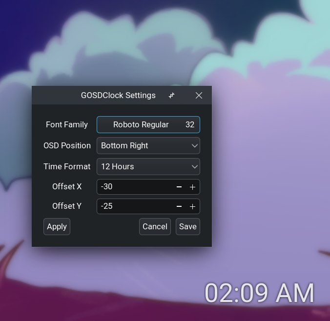

# GOSDClock
`gosdclock` is a utility program which shows the current time in the corner of the screen, written in gtkmm3 and C++.

This program is originally inspired from .



## Why
- Might be useful for setups with panel set to autohide (no clock when maximized window problem fixed :D)
- Might be used for people willing to maximize their ADHD

## Features
- Compiles into two executables: `gosdclock` and `gosdclock_settings`
- Automatically hides when hovered on it
- Can be further styled with `gtk.css`

## ~Installation~ Compilation and Testing
```
git clone https://github.com/mehedirm6244/gosdclock
cd gosdclock
mkdir build; cd build
cmake ..
cmake --build .
```

### Run `gosdclock` executable
```
./gosdclock
```


## Customization
### Using `gtk.css`
`gosdclock` window has the class `gosdclock` and `gosdclock_hidden` (activated when hovered) to provide necessary CSS support.

Example `gtk.css`
```
.gosdclock label {
	text-shadow: 0 0 3px black;
	transition: 0.1s;
	color: #eee;
	opacity: 0.9;
}

.gosdclock_hidden label {
	opacity: 0;
}
```

## Known Bugs
- Flickering when hovered (expected behavior due to poor implementation). Need X11 and Wayland-specific fixes
- Font size is set to 0 in font selector when `gosdclock_settings` is run, making scope for accidentally setting the font size to 0.
- Disappears when fullscreen is activated for any window. Requires X11 and wayland-specific fix
